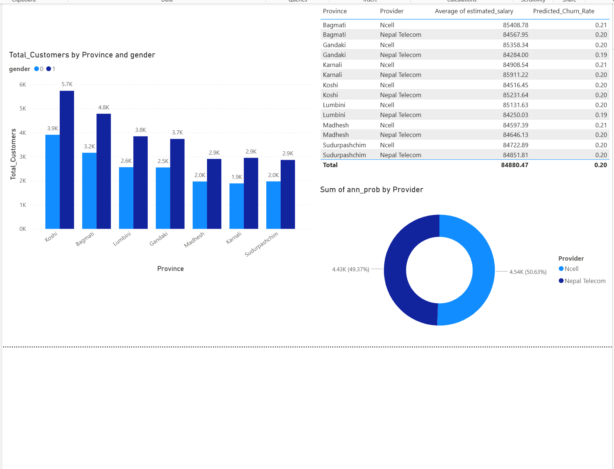
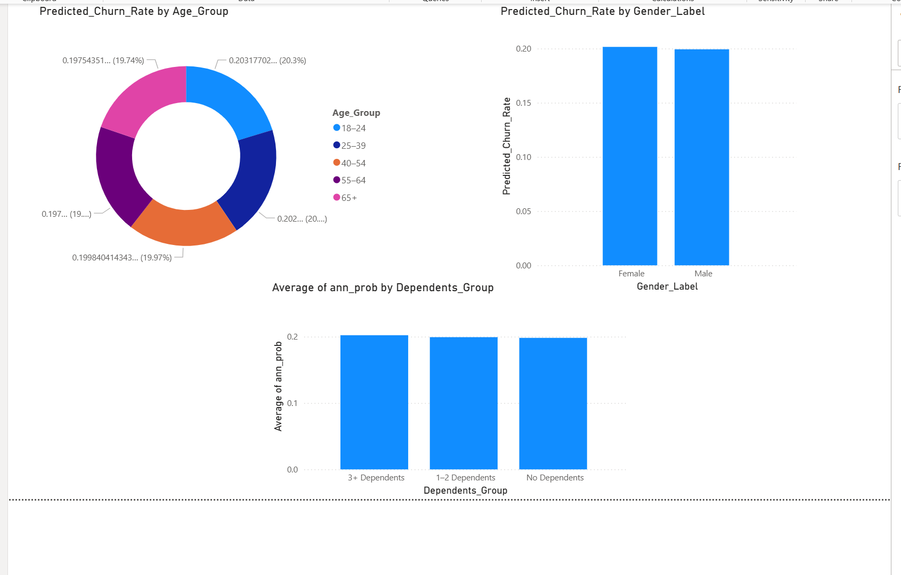
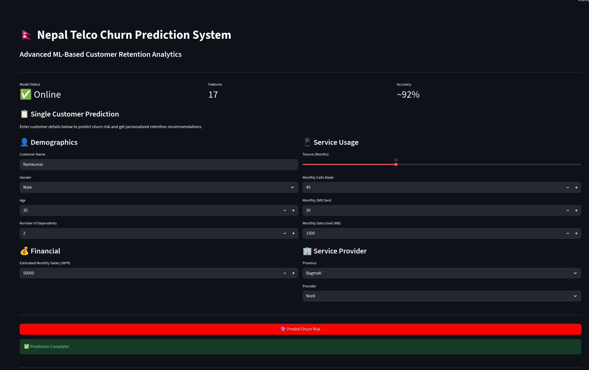
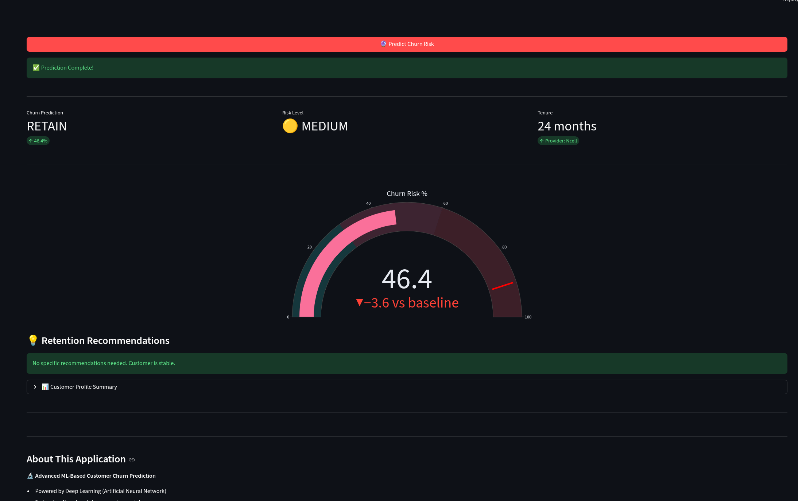
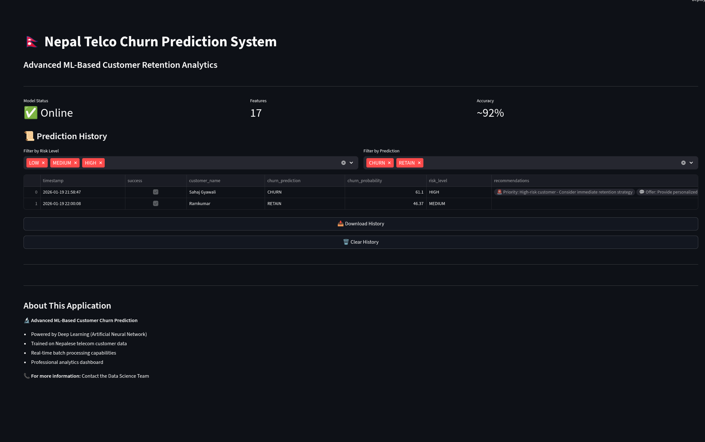

# Telecom Customer Churn Prediction

Predicting customer churn for the telecom sector using **XGBoost** and **Artificial Neural Networks (ANN)** on a localized dataset. Features 7-province mapping for Nepal and Power BI insights.

## Overview

This project leverages machine learning to predict customer churn in the telecom industry, helping businesses identify at-risk customers and take proactive retention measures. The solution includes data analysis, model training, and interactive visualizations.

## 🚀 Live Demo

**Try the application now**: [https://telco-churn-prediction-hq2y2n5cf5prntakqy97er.streamlit.app/](https://telco-churn-prediction-hq2y2n5cf5prntakqy97er.streamlit.app/)

The app is live and ready to use! Make predictions, view analytics, and explore customer churn patterns in real-time.

## Project Structure

```
telco_churn/
├── data/                      # Dataset files
│   ├── telecom_churn_raw.csv
│   ├── cleaned_churn_data.csv
│   └── churn_predictions_all_models.csv
├── notebook/                  # Jupyter notebooks
│   ├── 01_data_cleaning.ipynb
│   ├── 02_eda.ipynb
│   └── modeltraining.ipynb
├── src/                       # Source code
│   ├── ui.py                 # Streamlit UI
│   ├── model.py              # Model utilities
│   ├── predmodel.py          # Prediction model
│   └── __init__.py
├── model/                     # Trained models
│   └── Churnpred_ann.keras
├── powerbi/                   # Power BI resources
│   ├── nepal-states-topo.json
│   └── nepal-states.geojson
├── screenshot/               # Application screenshots
└── dashboard/                # Dashboard files
```

## Features

- **Machine Learning Models**: XGBoost and Artificial Neural Networks (ANN)
- **Geographic Mapping**: 7-province mapping for Nepal
- **Data Analysis**: Comprehensive exploratory data analysis (EDA)
- **Interactive Dashboard**: Streamlit-based UI for predictions
- **Power BI Integration**: Advanced visualizations and insights
- **Trained Models**: Pre-trained ANN model for quick predictions

## Screenshots

### Dashboard Overview


### Data Visualization


### Exploratory Data Analysis


### Model Performance


### Customer Segmentation


### Geographic Analysis


### Prediction Interface


### Model Comparison


### Insights and Recommendations


## Technologies Used

- **Python 3.13**
- **TensorFlow/Keras**: Deep learning framework
- **XGBoost**: Gradient boosting
- **Pandas & NumPy**: Data manipulation
- **Scikit-learn**: Machine learning utilities
- **Streamlit**: Interactive web interface
- **FastAPI**: Backend API
- **Power BI**: Business intelligence and visualization
- **GeoJSON**: Geographic data visualization

## Getting Started

### Prerequisites

- Python 3.13+
- pip or conda package manager

### Installation

1. Clone the repository:
```bash
git clone <repository-url>
cd telco_churn
```

2. Create and activate virtual environment:
```bash
python -m venv tf_venv
source tf_venv/bin/activate  # On Windows: tf_venv\Scripts\activate
```

3. Install dependencies:
```bash
pip install -r requirements.txt
```

### Running the Application

1. **Streamlit Dashboard**:
```bash
streamlit run src/ui.py
```

2. **FastAPI Server**:
```bash
python main.py
```

## Data Processing

The project follows a structured data pipeline:

1. **Data Cleaning** (`01_data_cleaning.ipynb`): Handles missing values, outliers, and data quality issues
2. **Exploratory Data Analysis** (`02_eda.ipynb`): Visualizes patterns and relationships
3. **Model Training** (`modeltraining.ipynb`): Trains and evaluates multiple models

## Models

- **ANN (Artificial Neural Network)**: Deep learning model with multiple layers
  - File: `model/Churnpred_ann.keras`
  - Provides accurate probabilistic predictions

- **XGBoost**: Gradient boosting model for high performance
  - Benchmarked against ANN for comparison

## Dataset

The dataset includes customer demographics, service usage, account information, and churn status for telecom customers across Nepal's 7 provinces.

### Local Focus

**This is localized data specific to Nepal** - The dataset represents actual telecom customer behavior and churn patterns in the Nepalese market. The analysis incorporates geographic, economic, and demographic characteristics unique to Nepal's 7 provinces, making this solution tailored for the South Asian telecom landscape.

### Key Features:
- Customer tenure
- Monthly charges
- Contract type
- Internet service type
- Phone service usage
- Customer service interactions
- Geographic location (7 provinces of Nepal)
- Local market dynamics and regional variations

## Results & Metrics

Models are evaluated using:
- Accuracy
- Precision and Recall
- F1-Score
- ROC-AUC
- Confusion Matrix

## Power BI Dashboard

Geographic analysis and advanced visualizations available in the Power BI dashboard using Nepal's state topology and GeoJSON files.

