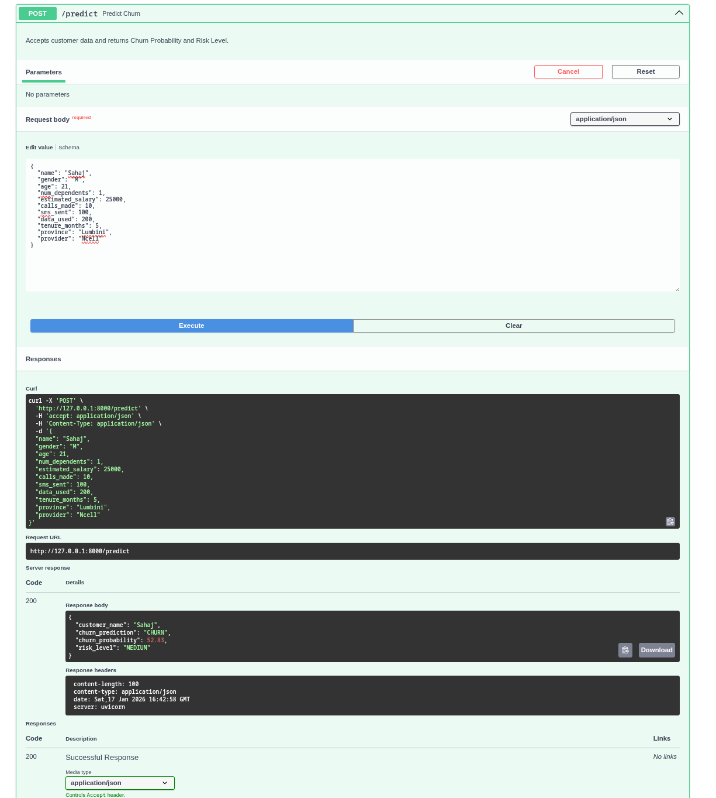
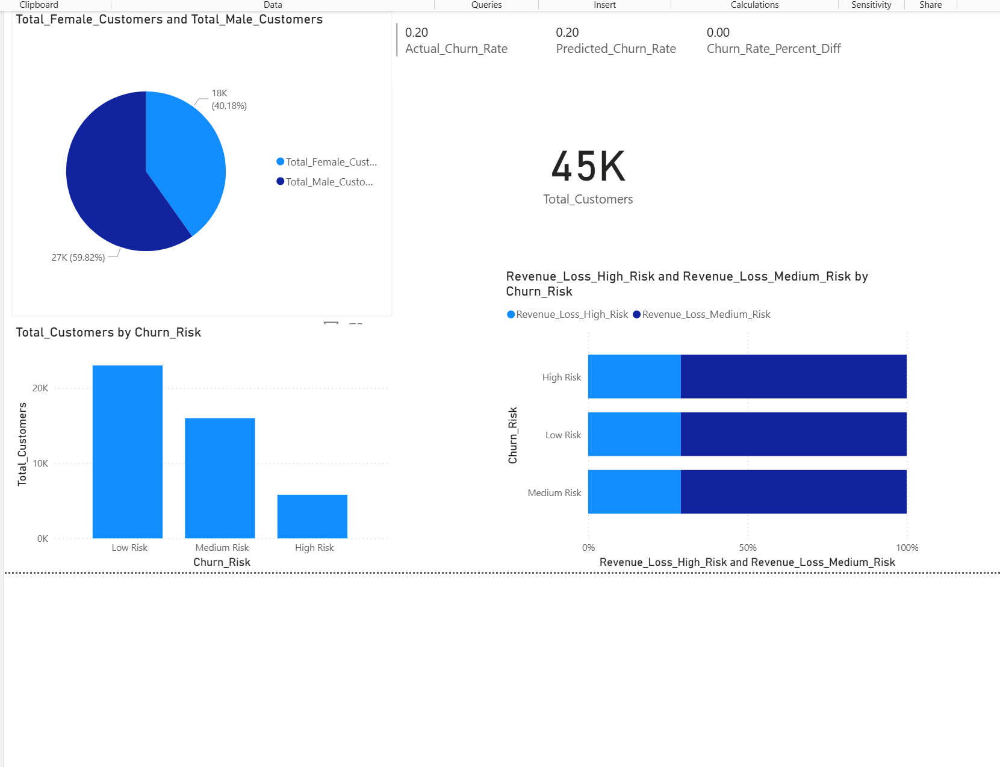
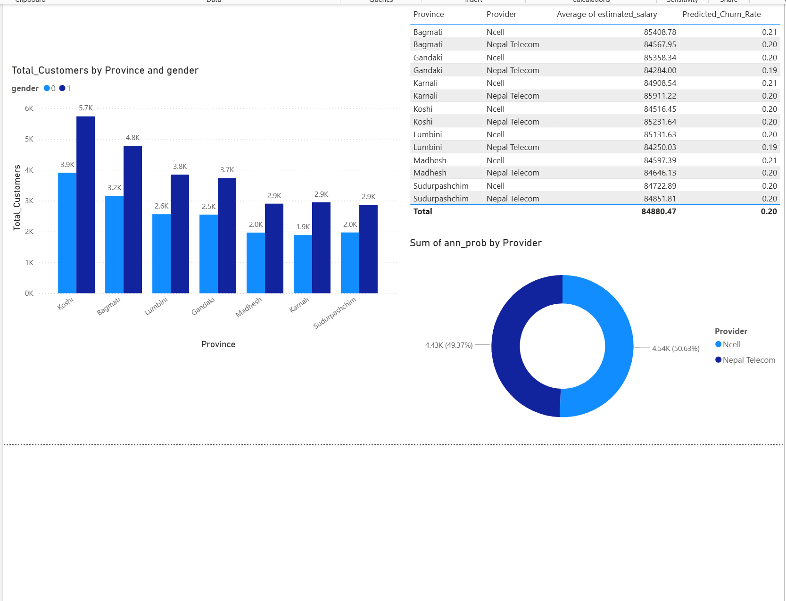
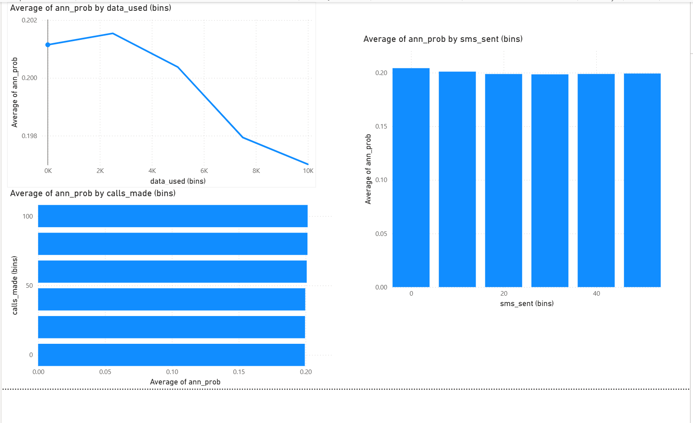
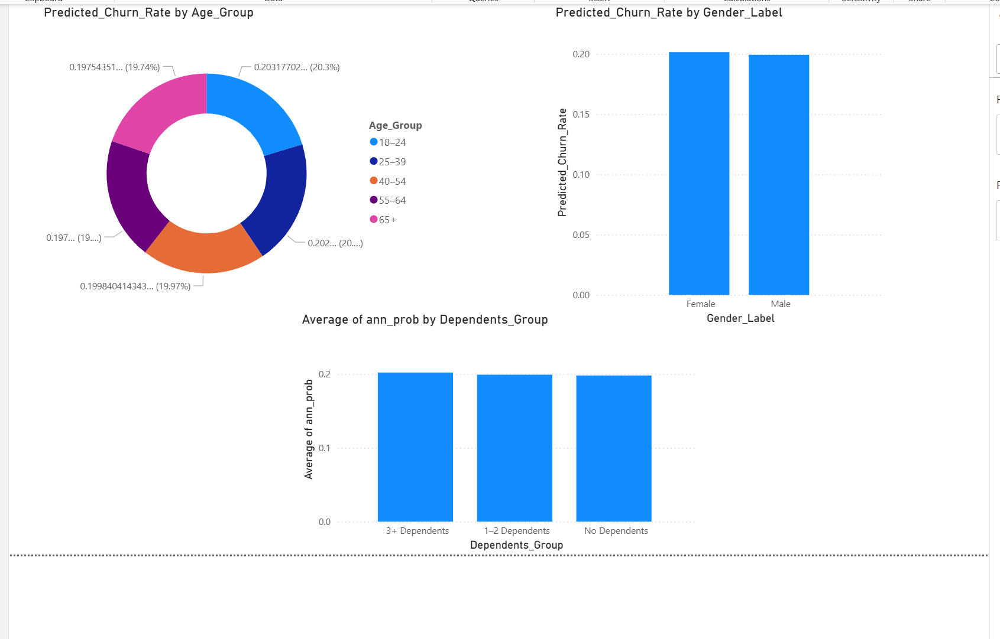
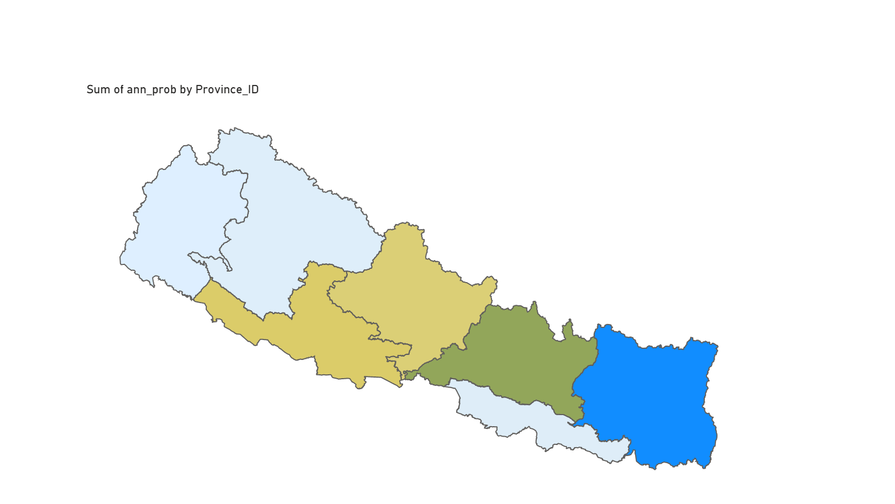
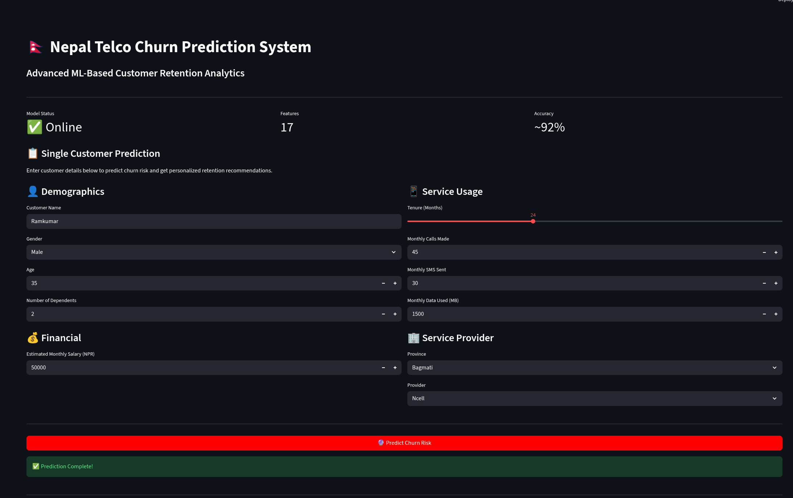
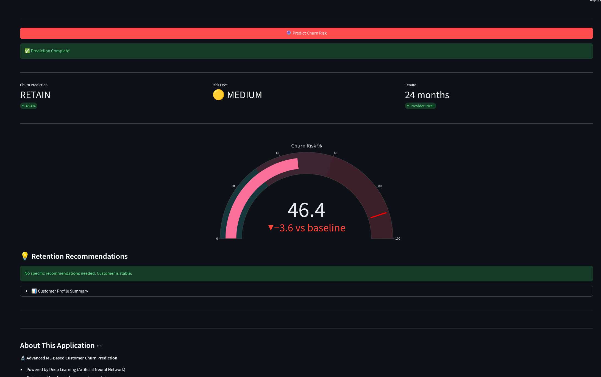
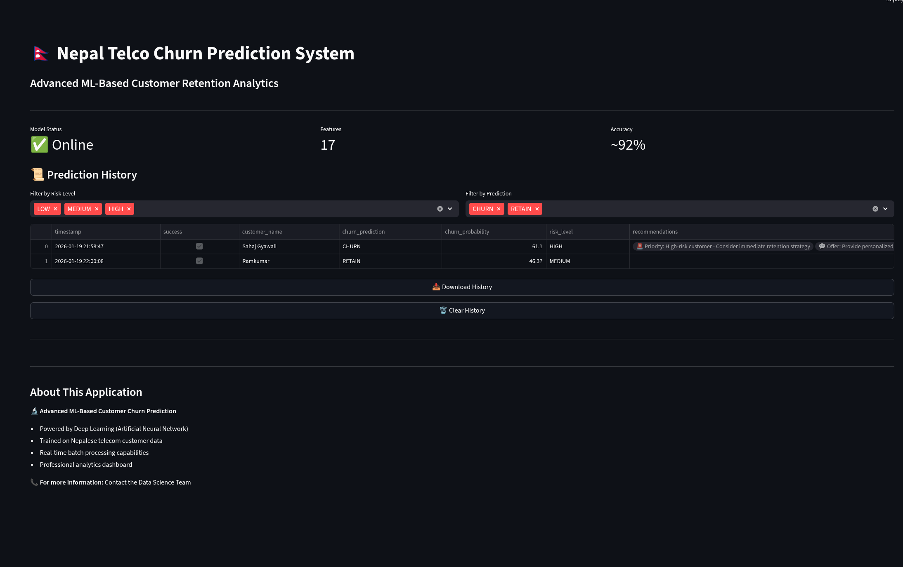

# Telecom Customer Churn Prediction

Predicting customer churn for the telecom sector using **XGBoost** and **Artificial Neural Networks (ANN)** on a localized dataset (Nepal 7-province mapping). 

## 🚀 Live Demo
**Try the application now**: [https://telco-churn-prediction-hq2y2n5cf5prntakqy97er.streamlit.app/](https://telco-churn-prediction-hq2y2n5cf5prntakqy97er.streamlit.app/)

## Screenshots

### Dashboard Overview


### Data Visualization


### Exploratory Data Analysis


### Model Performance


### Customer Segmentation


### Geographic Analysis


### Prediction Interface


### Model Comparison


### Insights and Recommendations


## 🛠 Tech Stack
- **Machine Learning**: TensorFlow/Keras, XGBoost, Scikit-learn
- **Data Processing**: Pandas, NumPy
- **Web App / API**: Streamlit, FastAPI
- **Visualization**: Power BI, GeoJSON

## ⚙️ Quick Start

**1. Clone & Install**
```bash
git clone <repository-url>
cd telco_churn
python -m venv tf_venv
source tf_venv/bin/activate  # Windows: tf_venv\Scripts\activate
pip install -r requirements.txt
```

**2. Run the App**
- **Streamlit Dashboard**: `streamlit run src/ui.py`
- **FastAPI Server**: `python main.py`

## 📂 Project Structure
- `data/`: Datasets (raw, cleaned, predictions)
- `notebook/`: Data cleaning, EDA & Model training notebooks
- `src/`: Source code (Streamlit UI, FastAPI backend)
- `model/`: Trained ANN/XGBoost models
- `powerbi/`: Dashboards & GeoJSON data
